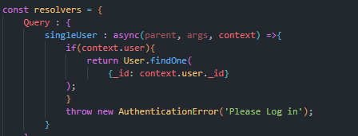

# booksQL

## Description

This application is a demo of Appolo server and graphQL being used to store and retrieve information to mongoDB.

[Link to Live Webpage](https://googlebookql.herokuapp.com/)

---

Here's a few quick links:

* [Installation and Usage](#Installation-and-Usage)
* [Code Snippets](#code-snippets)
* [Technology used](#technology-used)
* [License](#license)
* [Author](#author)
---

## Installation and Usage

1. Navigate to the [GitHub Repository](https://github.com/fiaschettima/booksQL) 
2. Clone the Repository to your computer
3. In terminal navigate to the cloned Repository
`
cd booksQL
`
4. After navigatiing to the file in terminal enter the command:
`
npm run develop
`
5. The book search engine will be loaded
 
---

## Code Snippets

This snippet of code shows the graphQL resolver to find a singler User.

---

## Technology Used
    
    JS
    Apollo
    GraphQl
    MongoDB

---

## License

    MIT License
---
## Author
    
    Matthew Fiaschetti 
[Github Profile](https://github.com/fiaschettima)
